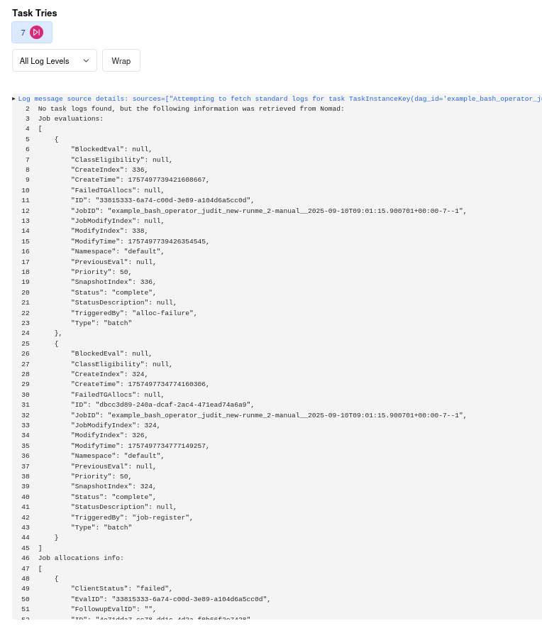

.. Licensed to the Apache Software Foundation (ASF) under one
    or more contributor license agreements.  See the NOTICE file
    distributed with this work for additional information
    regarding copyright ownership.  The ASF licenses this file
    to you under the Apache License, Version 2.0 (the
    "License"); you may not use this file except in compliance
    with the License.  You may obtain a copy of the License at

 ..   http://www.apache.org/licenses/LICENSE-2.0

 .. Unless required by applicable law or agreed to in writing,
    software distributed under the License is distributed on an
    "AS IS" BASIS, WITHOUT WARRANTIES OR CONDITIONS OF ANY
    KIND, either express or implied.  See the License for the
    specific language governing permissions and limitations
    under the License.

.. _NomadExecutor:

Nomad Executor
===================

.. note::

    The executor requires Airflow version 3.0.0 or higher.

The Nomad executor runs each task instance in its own container on a Nomad cluster.

NomadExecutor runs as a process in the Airflow Scheduler. The scheduler itself does
not at all need to be running on Nomad, but does need API access to a Nomad cluster.

When a DAG submits a task, the NomadExecutor requests a job execution via the Nomad API.

Usage
#################

Pre-requisites
**********************

Assuming that a Nomad cluster is already available, there must be a few configuration details
to be adjusted on the cluster's side.

Airflow executions will require two shared folders on each runner:

.. code-block:: hcl

    client {
      host_volume "config" {
        path      = "<server_path>/<runner_space>/config"
        read_only = true
      }

      host_volume "dags" {
        path      = "<server_path>/dags/"
        read_only = true
      }
    }

(Currently only host volumes are supported. Extending soon.)

 * ``dags``: Airflow runners need access to the dags that are to be executed
 * ``config``: Airflow runners need access to a local ``airflow.cfg``.

NOTE: This configuration is different from the Airflow server's configuration in terms of the following:
   
.. code-block:: ini

    [core]
    dags_folder = /opt/airflow/dags
    base_url = <airflow_api_server_url>

    [logging]
    base_log_folder = /opt/airflow/logs

Enabling ``NomadExecutor``
**********************************

To enable ``NomadExecutor`` to perform action, the Airflow Scheduler service
configuration has to contain the following information:

.. code-block:: ini

   [core]
   executor = airflow.providers.nomad.executors.nomad_executor.NomadExecutor

   [nomad_executor]
   server_ip = <server_ip>

After these changes, the scheduler has to be restarted with 

.. code-block::

    airflow scheduler

From this point on Airflow pipeline tasks will be submitted to the target Nomad cluster.

Each task is executed as a separate Nomad task, in an individual taskgroup. This maps
each of them to different docker containers.

Configuration
#################

Configuration options that are available for ``NomadExecutor`` are to be found in the ``nomad_executor`` section of the Airflow configuration.

``parallelism``: Airflow executor setting: the maximum number of tasks to be run by this executor in parallel.

``server_ip``: The IP address of the Nomad server. (Default: ``127.0.0.1``)

``default_job_template``: A custom HCL or JSON template to be used for job submission instead of the in-built defaults. See the `Job submission template`_ section.

``alloc_pending_timeout``: How long to wait (in seconds) before failing a task pending with failed Nomad allocations. See `Job execution`_ for more information.

``secure``: Whether TLS is enabled. 

``verify``: This configuration may either hold a boolean value (``true``/``false``) or the absolute path of the CA certificate. (Exactly as for `Python Requests SSL cert verification <https://docs.python-requests.org/en/latest/user/advanced/#ssl-cert-verification>`_)

``cert_path``: The absolute path of the client certificate.

``key_path``: The absolute path of the client key.

For TLS-related configuration in detail, see the `Security`_ section.

Job submission template
*******************************

There is a single job template taken as the base for all job submissions. This is adjusted to individual job submissions correspondingly.
Core assumptions regarding the job submission template:

- The Docker driver is used
- The template has to consist of a single Nomad ``Job`` on the highest level
- The job template is using a single ``TaskGroup`` with a single ``Task``. 
- ``RestartPolicy`` has to be set to ``Mode``: ``fail`` with ``Attemtps`` being set to ``0``

Each Airflow task is submitted as a separate Nomad job. Though this may be against the Nomad philosophy, this arrangement allows smooth integration to the Airflow concept of Task Groups (which involve individual submissions). This is also the reason why we want no retries on Nomad level. This way job submission re-try will be fully handled by Airflow, as submission of a brand-new job. 

The Docker image referred by the template should:

- have ``apache-airflow-core`` and ``apache-airflow-task-sdk`` installed
- should be ready to run Python command-line executions shipped as ``args`` to the Docker container
- NOTE: Any existing args of the template will be overridden by the job submission command

Defaults:

- The Docker image used by default was generated using the ``Dockerfile`` available at ``src/airflow/providers/nomad/docker``
- The default job submission template resides in the ``src/airflow/providers/nomad/templates/nomad_job_template.py``.

The default job submission template can be overridden by the `nomad_executor/default_job_template` configuration parameter, expecting
HCL or JSON template. For successful job submission the template has to comply to the above.

Security
###############

Secure connection to a Nomad cluster is supported. 

In terms of Nomad configuration, corresponding Nomad certificates must be available
(see `Enable TLS encryption <https://developer.hashicorp.com/nomad/docs/secure/traffic/tls>`_).

We assume that the Nomad client is running a similar configuration to:

.. code-block:: hcl

    client {
      host_volume "config" {
        path      = "<server_path>/<runner_space>/config"
        read_only = true
      }

      host_volume "dags" {
        path      = "<server_path>/dags/"
        read_only = true
      }
    }

    # Require TLS

    tls {
      http = true
      rpc  = true

      ca_file   = "certs/nomad-agent-ca.pem"
      cert_file = "certs/global-client-nomad.pem"
      key_file  = "certs/global-client-nomad-key.pem"

      verify_server_hostname = false
      verify_https_client    = false
    }

The Airflow configuration of the Airflow scheduler (running ``NomadExecutor``) has to be changed such as

.. code-block:: ini

    [nomad_executor]
    server_ip = <nomad_server_ip>
    cert_path = /home/devel/share/workspace_airflow/nomad_provider/certs/global-cli-nomad.pem
    key_path = /home/devel/share/workspace_airflow/nomad_provider/certs/global-cli-nomad-key.pem
    verify = /home/devel/share/workspace_airflow/nomad_provider/certs/nomad-agent-ca.pem
    secure = true

Having restarted the scheduler, job submission to the Nomad cluster is enabled.

.. note::

   In case of self-signed certificates, make sure that ``keyUsage`` extension is enabled and required (see `helpful guidelines <https://www.herongyang.com/PKI-Certificate/OpenSSL-Add-keyUsage-into-Root-CA.html>`_)

Job execution
#################

The execution workflow is fairly basic so far. In principal, following the Airflow standards:

- job remain in a ``QUEUED`` state until successfully contacting the API server confirming that ``RUNNING`` state started
- ``SUCCESS`` or ``FAILED`` state is declared based on the task reporting to the API server

In addition, Nomad-side failures are also considered. Such errors can have multiple reasons.

Allocation failures:

    Allocation failures may not be real failures. They can occur for example when the cluster is overloaded, or if
    requested resources may not be temporarily available. Depending on the job configuration, these may have automated
    re-allocation attempts. 
    Such tasks have a time delay defined by the ``nomad_executor/alloc_penidng_timeout``. In case
    they show no change in state, they are failed by the executor as the timeout expires.
    (The Airflow tasks are forcefully moved to a ``FAILED`` state by the executor, and the corresponding Nomad jobs are stopped.)

Job submission failures:

    On the other hand, actual failures may happen before job execution could start. (For example: specified Docker image can't be downloaded.)
    On these occasions, the Airflow jobs are set to ``FAILED`` and the Nomad jobs are stopped right away.

Once the executor may move tasks to a ``FAILED`` state, Airflow-level re-tries apply.

Analysis on the Nomad context is performed, aiming to provide information about the failures, both in the Airflow service logs and the job logs.

Logging
#############

Logging for the ``NomadExexutor`` takes multiple measures on top of collecting traditional job output.

On one hand, Nomad is collecting job output (``stdout``) and errors (``stderr``) as separate outputs. We make sure
that both are collected.

In addition, in case job execution may fail before the task could run, Nomad data sources are examined and
shared with the user, allowing to get more context to the failure. (See the image below.)

``NomadExecutor`` supports the default Airflow logger (``FileTaskHandler`` or ``task``). This is the preferred
method to be used for remote logging (or in case Nomad logs may be locally mounted).

In case none of the above, ``NomadLoghandler`` may be enabled (see `NomadLoghandler <nomad_logger.html>`_).

    The above image is showing the Nomad context once task execution did not perform.
